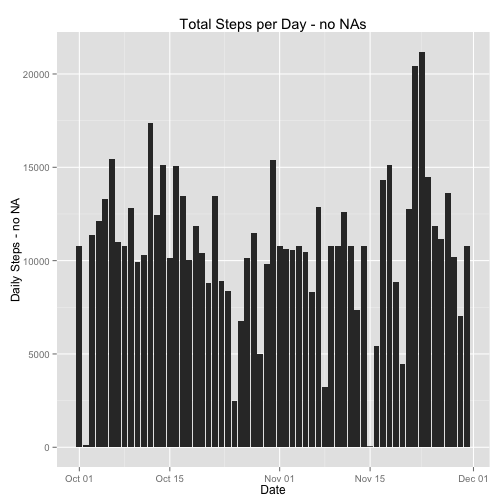

===========================================
# Reproducible Research: Peer Assessment 1
## Jorge Latre
===========================================


```r
library(reshape2)
library(plyr)
library(dplyr)
library(lubridate)
library(ggplot2)
library(lattice)
```

Get the activity data from its web repository


```r
url <- "http://d396qusza40orc.cloudfront.net/repdata%2Fdata%2Factivity.zip"
download.file(url, "repdata-data-activity.zip", mode="wb")
unzip("repdata-data-activity.zip")
```


```r
file <- "activity.csv"
activity <- read.csv(file, header=TRUE, na.strings="NA", 
                     colClasses=c("integer", "character", "integer"))
activity$date <- ymd(activity$date)
str(activity)
```

```
## 'data.frame':	17568 obs. of  3 variables:
##  $ steps   : int  NA NA NA NA NA NA NA NA NA NA ...
##  $ date    : POSIXct, format: "2012-10-01" "2012-10-01" ...
##  $ interval: int  0 5 10 15 20 25 30 35 40 45 ...
```


```r
tidyActivity <- melt(activity, id=c("date", "interval", "steps"), na.rm=TRUE)
dateByinterval <- dcast(tidyActivity, date ~ interval, fun.aggregate=sum) # with the assignment data: 61 dates x 288 intervals
```

```
## Using steps as value column: use value.var to override.
```

```r
dateByinterval$date <- ymd(dateByinterval$date)
```

## What is mean total number of steps taken per day?

1. Make a histogram of the total steps taken each day.
(computed without removing NAs)


```r
dailyStepswNA <- rowSums(select(dateByinterval, -date))
qplot(data=dateByinterval, x=date, y=dailyStepswNA, geom="histogram", stat="identity")
```

```
## Warning: Removed 8 rows containing missing values (position_stack).
```

 

2. What is the mean total number of steps taken per day?


```r
mean(dailyStepswNA, na.rm=TRUE)
```

```
## [1] 10766.19
```

3. What is the median total number of steps taken per day?


```r
median(dailyStepswNA, na.rm=TRUE)
```

```
## [1] 10765
```

## What is the average daily activity pattern?

1. Make a time series plot of the 5-minute interval and the average number of steps taken, averaged across all days.


```r
totalIntervalTime <- colSums(select(dateByinterval, -date), na.rm=TRUE)
averageIntervalTime <- data.frame(Interval=unique(activity$interval), 
                                  averageItime=totalIntervalTime/length(totalIntervalTime)) 
qplot(Interval,averageItime, data=averageIntervalTime, geom="line", main="Average Steps per Interval in a Day", 
      ylab="Average Steps")
```

 

2. Which 5-minute interval, on average across all the days in the dataset, contains the maximum number of steps?


```r
averageIntervalTime$Interval[which.max(averageIntervalTime$averageItime)]  
```

```
## [1] 835
```

## Imputing missing values

1. Calculate and report the total number of missing values in the dataset (i.e. the total number of rows with NAs)


```r
sum(is.na(activity$steps))
```

```
## [1] 2304
```

2. Devise a strategy for filling in all of the missing values in the dataset. The strategy does not need to be sophisticated. For example, you could use the mean/median for that day, or the mean for that 5-minute interval, etc.

I choose to replace NA with the mean of the steps in a given interval, on the premise that it is both more meaningful than taking the mean across an entire day and is as simple an approach as it gets.

3. Create a new dataset that is equal to the original dataset but with the missing data filled in.


```r
meanInts <-  apply(select(dateByinterval, -date), 2, mean, na.rm=TRUE) # mean of each interval across dates
activitynoNA <- activity # initialize the new dataset
i <- 1
while (i < 17568) {
    if (is.na(activitynoNA$steps[i])) {
            j <- i+287
            activitynoNA$steps[i:j] <- meanInts # replace NAs with the means; NAs are only found across full days
        }
        i <- i + 288
    }

str(activitynoNA)
```

```
## 'data.frame':	17568 obs. of  3 variables:
##  $ steps   : num  1.717 0.3396 0.1321 0.1509 0.0755 ...
##  $ date    : POSIXct, format: "2012-10-01" "2012-10-01" ...
##  $ interval: int  0 5 10 15 20 25 30 35 40 45 ...
```

```r
# A function to replace NA with the mean of the steps in an interval in our tidy set
from.NA.to.mean=function(x){
    x<-as.numeric(as.character(x))
    x[is.na(x)] <- mean(x, na.rm=TRUE) 
    x
}
# Apply the function
dateByintervalnoNA <- data.frame(apply(select(dateByinterval, -date),2,from.NA.to.mean), stringsAsFactors=FALSE)
date <- select(dateByinterval, date)
dateByintervalnoNA <- cbind(date, dateByintervalnoNA)
```

4. Make a histogram of the total number of steps taken each day.


```r
dailyStepsnoNA <- rowSums(select(dateByintervalnoNA, -date))
qplot(data=dateByintervalnoNA, x=date, y=dailyStepsnoNA, geom="histogram", stat="identity", 
      xlab="Date", ylab="Daily Steps - no NA", main="Total Steps per Day - no NAs")
```

 

Calculate and report the mean and median total number of steps taken per day. Do these values differ from the estimates from the first part of the assignment? What is the impact of imputing missing data on the estimates of the total daily number of steps?

Mean:

```r
mean(dailyStepsnoNA)
```

```
## [1] 10766.19
```
Difference between imputed set and original set means:

```r
mean(dailyStepsnoNA) - mean(dailyStepswNA, na.rm=TRUE)
```

```
## [1] 0
```

Median:

```r
median(dailyStepsnoNA)
```

```
## [1] 10766.19
```
Difference between imputed set and original set medians:

```r
median(dailyStepsnoNA) - median(dailyStepswNA, na.rm=TRUE)
```

```
## [1] 1.188679
```

No difference for the means, and very little difference between medians, as a result of how we have substituted for NAs - 
with averages across all dates.

## Are there differences in activity patterns between weekdays and weekends?

1. Create a new factor variable in the dataset with two levels – “weekday” and “weekend” indicating whether a given date is a weekday or weekend day.


```r
dayOfweek <- weekdays(as.Date(dateByintervalnoNA$date, format="%Y-%m-%d"))
weekEnd <- dayOfweek == "Saturday" | dayOfweek == "Sunday"
dayOfweek[weekEnd==TRUE] <- "Weekend"
dayOfweek[weekEnd==FALSE] <- "Weekday"
dayOfweek <- as.factor(dayOfweek)
```

2 Make a panel plot containing a time series plot of the 5-minute interval and the average number of steps taken, averaged across all weekday days or weekend days.


```r
dBinNdayOfweek <- cbind(dayOfweek, dateByintervalnoNA)


wDA <- dBinNdayOfweek[dBinNdayOfweek$dayOfweek=="Weekday",]
wEA <- dBinNdayOfweek[dBinNdayOfweek$dayOfweek=="Weekend",]
tswDA <- colSums(select(wDA, -(1:2)))/length(wDA)
tswEA <- colSums(select(wEA, -(1:2)))/length(wEA)
x <- seq(1,2355, length.out=288)

par(mfrow = c(2, 1)) 
with(dBinNdayOfweek, {
    plot(x, tswDA, ylim=c(0,30), main = "Weekday", xlab="Interval", ylab= "Avg Steps", type="l")
    plot(x, tswEA, ylim=c(0,30), main = "Weekend", xlab="Interval", ylab= "Avg Steps", type="l") 
})
```

 

There is a lot less activity during the week-end, and it ramps up later in the day. Minute 500 roughly corresponds to wakeup time (the flat, 0-level part of the curve must be sleeping time). Peak activity (a bit before minute 1000) coincides on week-ends and weekdays.
coincides on weekdays and weekends
