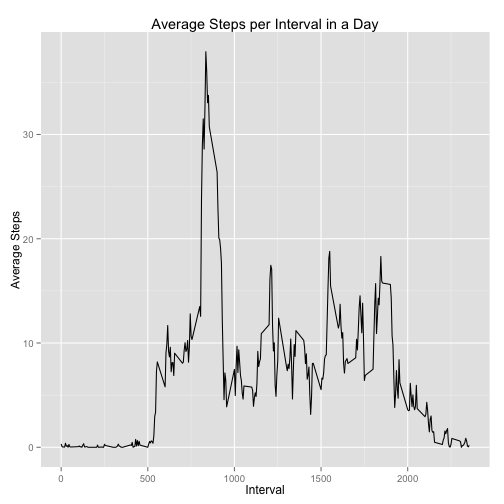
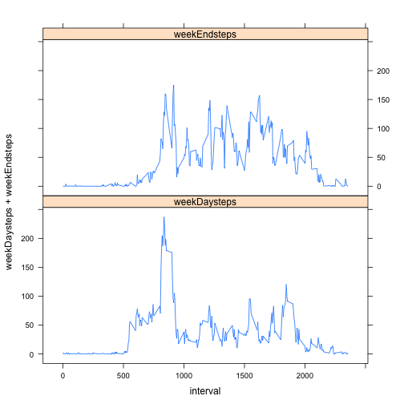

===========================================
# Reproducible Research: Peer Assessment 1
## Jorge Latre
===========================================


```r
library(reshape2)
library(plyr)
library(dplyr)
library(lubridate)
library(ggplot2)
library(lattice)
```

Get the activity data from its web repository

#```{r}
url <- "http://d396qusza40orc.cloudfront.net/repdata%2Fdata%2Factivity.zip"
download.file(url, "repdata-data-activity.zip", mode="wb")
unzip("repdata-data-activity.zip")
```


```r
file <- "activity.csv"
activity <- read.csv(file, header=TRUE, na.strings="NA", 
                     colClasses=c("integer", "character", "integer"))
activity$date <- ymd(activity$date)
str(activity)
```

```
## 'data.frame':	17568 obs. of  3 variables:
##  $ steps   : int  NA NA NA NA NA NA NA NA NA NA ...
##  $ date    : POSIXct, format: "2012-10-01" "2012-10-01" ...
##  $ interval: int  0 5 10 15 20 25 30 35 40 45 ...
```

## What is mean total number of steps taken per day?

1. Make a histogram of the total steps taken each day.
(computed without removing NAs)


```r
byDate <- group_by(activity, date)
dailySteps <- summarise(byDate, dailySteps = sum(steps, na.rm=TRUE))
hist(dailySteps$dailySteps, breaks=10, xlab="Daily Steps", main="Histogram of Daily Steps")
```

 

2. What is the mean total number of steps taken per day?


```r
mean(dailySteps$dailySteps)
```

```
## [1] 9354.23
```

3. What is the median total number of steps taken per day?


```r
median(dailySteps$dailySteps)
```

```
## [1] 10395
```

## What is the average daily activity pattern?

1. Make a time series plot of the 5-minute interval and the average number of steps taken, averaged across all days.


```r
byInterval <- group_by(activity, interval) 
meanSteps <- summarise(byInterval, meanSteps=mean(steps, na.rm=TRUE))
qplot(interval,meanSteps, data=meanSteps, geom="line", 
      main="Average Steps per Interval in a Day", xlab="Interval", ylab="Average Steps")
```

 

2. Which 5-minute interval, on average across all the days in the dataset, contains the maximum number of steps?


```r
meanSteps$interval[which.max(meanSteps$meanSteps)]  
```

```
## [1] 835
```

## Imputing missing values

1. Calculate and report the total number of missing values in the dataset (i.e. the total number of rows with NAs)


```r
sum(is.na(activity$steps))
```

```
## [1] 2304
```

2. Devise a strategy for filling in all of the missing values in the dataset. The strategy does not need to be sophisticated. For example, you could use the mean/median for that day, or the mean for that 5-minute interval, etc.

NAs are only present across entire days. Either we have data for a whole day, or we have none. I choose to replace the NAs with the average number of steps in each interval across days of the same week, on the assumption that the subject has a weekly schedule.

3. Create a new dataset that is equal to the original dataset but with the missing data filled in.


```r
# Compute mean steps by interval for each weekday to substitute NAs in every corresponding weekday
dayOfweek <- weekdays(activity$date)
activity$dayOfweek <- weekdays(activity$date)
byWeekday <- group_by(activity, dayOfweek)

monStepsByint <- group_by(filter(byWeekday, dayOfweek=="Monday"), interval)
monSteps <- summarise(monStepsByint, daySteps=mean(steps, na.rm=TRUE)) # loop across six days?
wedStepsByint <- group_by(filter(byWeekday, dayOfweek=="Wednesday"), interval)
wedSteps <- summarise(wedStepsByint, daySteps=mean(steps, na.rm=TRUE))
thuStepsByint <- group_by(filter(byWeekday, dayOfweek=="Thursday"), interval)
thuSteps <- summarise(thuStepsByint, daySteps=mean(steps, na.rm=TRUE)) # loop across six days?
friStepsByint <- group_by(filter(byWeekday, dayOfweek=="Friday"), interval)
friSteps <- summarise(friStepsByint, daySteps=mean(steps, na.rm=TRUE))
satStepsByint <- group_by(filter(byWeekday, dayOfweek=="Saturday"), interval)
satSteps <- summarise(satStepsByint, daySteps=mean(steps, na.rm=TRUE)) # loop across six days?
sunStepsByint <- group_by(filter(byWeekday, dayOfweek=="Sunday"), interval)
sunSteps <- summarise(sunStepsByint, daySteps=mean(steps, na.rm=TRUE))

# substitution
activitynoNA <- activity

activitynoNA$steps[is.na(activitynoNA$steps) & activitynoNA$dayOfweek=="Monday"] <- monSteps$daySteps
activitynoNA$steps[is.na(activitynoNA$steps) & activitynoNA$dayOfweek=="Wednesday"] <- wedSteps$daySteps
activitynoNA$steps[is.na(activitynoNA$steps) & activitynoNA$dayOfweek=="Thursday"] <- thuSteps$daySteps
activitynoNA$steps[is.na(activitynoNA$steps) & activitynoNA$dayOfweek=="Friday"] <- friSteps$daySteps
activitynoNA$steps[is.na(activitynoNA$steps) & activitynoNA$dayOfweek=="Saturday"] <- satSteps$daySteps
activitynoNA$steps[is.na(activitynoNA$steps) & activitynoNA$dayOfweek=="Sunday"] <- sunSteps$daySteps

str(activitynoNA)
```

```
## 'data.frame':	17568 obs. of  4 variables:
##  $ steps    : num  1.43 0 0 0 0 ...
##  $ date     : POSIXct, format: "2012-10-01" "2012-10-01" ...
##  $ interval : int  0 5 10 15 20 25 30 35 40 45 ...
##  $ dayOfweek: chr  "Monday" "Monday" "Monday" "Monday" ...
```

4. Make a histogram of the total number of steps taken each day.


```r
byDatenoNA <- group_by(activitynoNA, date)
dailyStepsnoNA <- summarise(byDatenoNA, dailySteps = sum(steps, na.rm=TRUE))
hist(dailyStepsnoNA$dailySteps, breaks=10, xlab="Daily Steps", main="Histogram of Daily Steps")
```

 

Calculate and report the mean and median total number of steps taken per day. Do these values differ from the estimates from the first part of the assignment? What is the impact of imputing missing data on the estimates of the total daily number of steps?

Mean:

```r
mean(dailyStepsnoNA$dailySteps)
```

```
## [1] 10821.21
```
Difference between imputed set and original set means:

```r
mean(dailyStepsnoNA$dailySteps) - mean(dailySteps$dailySteps)
```

```
## [1] 1466.98
```

Median:

```r
median(dailyStepsnoNA$dailySteps)
```

```
## [1] 11015
```
Difference between imputed set and original set medians:

```r
median(dailyStepsnoNA$dailySteps) - median(dailySteps$dailySteps)
```

```
## [1] 620
```

Significant difference for the means: we have in effect deemphasized the influence of Tuesdays over the means, as only the
other days had NAs to be substituted with THEIR averages.
No difference for the medians: we did not change the distribution of activities on either side of the original medians when 
we substituted the averages from existing days. 

## Are there differences in activity patterns between weekdays and weekends?

1. Create a new factor variable in the dataset with two levels – “weekday” and “weekend” indicating whether a given date is a weekday or weekend day.


```r
weekEnd <- dayOfweek == "Saturday" | dayOfweek == "Sunday"
dayOfweek[weekEnd==TRUE] <- "Weekend"
dayOfweek[weekEnd==FALSE] <- "Weekday"
dayOfweek <- as.factor(dayOfweek)
activitynoNA$fdayOfweek <- dayOfweek
```

2 Make a panel plot containing a time series plot of the 5-minute interval and the average number of steps taken, averaged across all weekday days or weekend days.


```r
byIntWD <- group_by(filter(activitynoNA, fdayOfweek=="Weekday"), interval)
byIntWE <- group_by(filter(activitynoNA, fdayOfweek=="Weekend"), interval)
WDsteps <- summarise(byIntWD, weekDaysteps=mean(steps, na.rm=TRUE))
WEsteps <- summarise(byIntWE, weekEndsteps=mean(steps, na.rm=TRUE))
allSteps <- join(WDsteps, WEsteps, "interval")

xyplot(weekDaysteps + weekEndsteps ~ interval, data = allSteps, layout = c(1,2), type = "l", outer = TRUE)
```

 

There is more activity during the week-end. Minute 500 roughly corresponds to wakeup time (the flat, 0-level part of the curve must be sleeping time). Peak activity (a bit before minute 1000) coincides on week-ends and weekdays.
